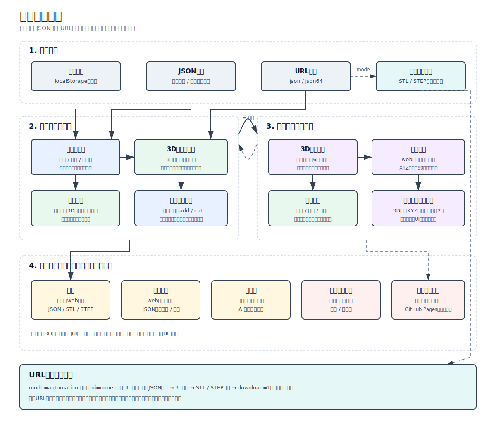
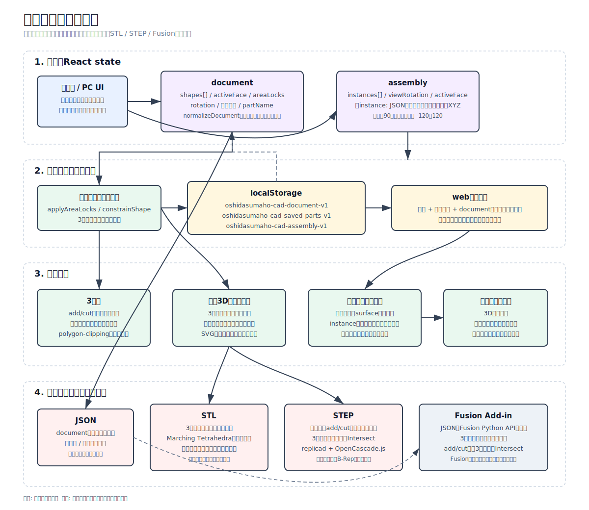

# Oshida Smartphone CAD

スマートフォンのブラウザで、上面・正面・右側面に四角形や円を配置して機械部品を作る軽量CADです。単品部品の3面編集、3Dプレビュー、JSON/STL/STEP出力と、保存した部品を配置するアセンブリ機能を開発しています。

## Architecture

### 画面状態遷移

単品部品の面編集、3D操作、保存・呼び出し、アセンブリへの切替を示しています。



### データと処理の流れ

React state、localStorage、3D描画、ファイル出力、Fusion Add-inまでのデータ経路を示しています。



## Frontend

- React + Viteのシングルページアプリ
- 上部は固定プレビュー、下部は選択対象に応じて切り替わる編集UI
- 単品部品モードは上面・正面・右側面と3Dプレビューを表示
- アセンブリモードは保存部品のXYZ配置、90度回転、色変更と3面投影に対応
- 図形の2Dブーリアンには `polygon-clipping`、三角形分割には `earcut` を使用

## Browser Storage

ブラウザ保存は `localStorage` を使用します。ブラウザのサイトデータを削除すると消えるため、永続保存にはJSON出力を使用してください。

| Key | 内容 |
| --- | --- |
| `oshidasumaho-cad-document-v1` | 現在編集中の単品部品 |
| `oshidasumaho-cad-saved-parts-v1` | 名前を付けてweb保存した部品一覧 |
| `oshidasumaho-cad-assembly-v1` | アセンブリの部品配置と表示状態 |

## Output

- **JSON**: 図形、面、add/cut、エリアロック、表示状態を含む再編集用データ
- **STL**: 3面形状から距離場を作り、Marching Tetrahedraで閉じた三角形メッシュを生成
- **STEP**: `replicad` + `OpenCascade.js`で面別ソリッドを構築し、3方向の交差形状をB-Repとして出力
- **Fusion**: JSONをPython Add-inで読み込み、Fusion API上で3方向のソリッドを再構築

## Development

```bash
npm install
npm run dev
npm run build
```

## Fusion Add-in

FusionでJSONを読み込み、Fusion上のソリッドとして再構築するPython Add-inを `fusion_addin/` に追加しています。

詳しくは [fusion_addin/README.md](fusion_addin/README.md) を参照してください。

## Discord notification

Set `DISCORD_WEBHOOK_URL` in your local `.env` or shell environment before running `scripts/codex_notify_discord.py`. Do not commit webhook URLs.
