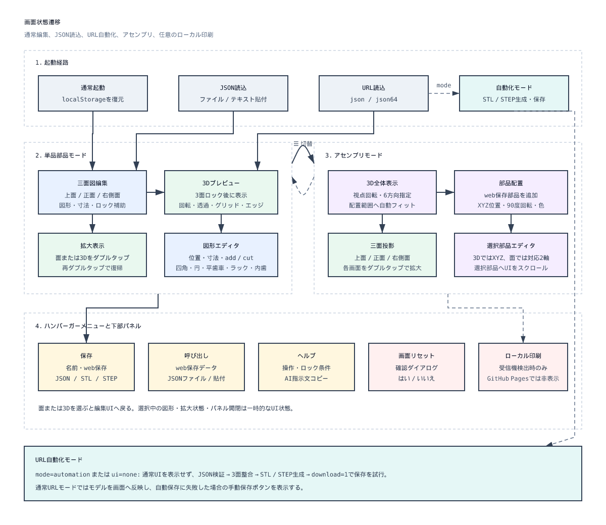
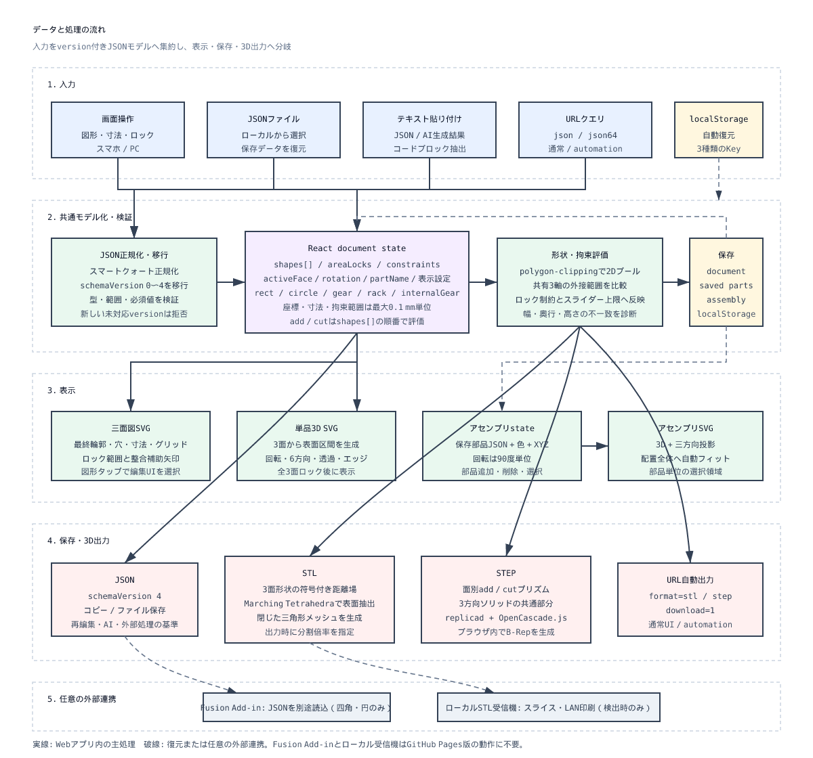

# Oshida Smartphone CAD

スマートフォンのブラウザで、上面・正面・右側面に四角形、円、平歯車、ラックギヤ、内歯車を配置して機械部品を作る軽量CADです。単品部品の3面編集、3Dプレビュー、JSON/STL/STEP出力と、保存した部品を配置するアセンブリ機能を開発しています。

## 構成図

### 画面状態遷移

単品部品の面編集、3D操作、保存・呼び出し、アセンブリへの切替を示しています。



[SVG版](docs/architecture/ui-state-flow.svg)

### データと処理の流れ

JSONの入力、React state、形状処理、localStorage、3D描画、ファイル出力と任意の外部連携までのデータ経路を示しています。



[SVG版](docs/architecture/data-processing-flow.svg)

## Frontend

- React + Viteのシングルページアプリ
- 上部は固定プレビュー、下部は選択対象に応じて切り替わる編集UI
- 単品部品モードは上面・正面・右側面と3Dプレビューを表示
- 平歯車は20度圧力角のインボリュート歯形で、モジュール、歯数、中央穴径を編集可能
- ラックギヤは20度圧力角で、モジュール、整数歯数、全幅、歯先から底面までの全高、90度単位の回転を編集可能。標準幅を超える1歯未満の余長だけを終端側の歯底ランドとして追加
- 内歯車は20度圧力角で、モジュール、整数歯数、外径を成立範囲内で編集可能
- アセンブリモードは保存部品のXYZ配置、90度回転、色変更と3面投影に対応
- 図形の2Dブーリアンには `polygon-clipping`、三角形分割には `earcut` を使用

## Browser Storage

ブラウザ保存は `localStorage` を使用します。ブラウザのサイトデータを削除すると消えるため、永続保存にはJSON出力を使用してください。

| Key | 内容 |
| --- | --- |
| `oshidasumaho-cad-document-v1` | 現在編集中の単品部品 |
| `oshidasumaho-cad-saved-parts-v1` | 名前を付けてweb保存した部品一覧 |
| `oshidasumaho-cad-assembly-v1` | アセンブリの部品配置と表示状態 |

## JSON Import

プレビュー右上のメニューから **呼び出し** を開き、ローカルのJSONファイルを選択するとモデルを復元できます。JSON保存直後のファイルは、図形、座標、サイズ、add/cutの順序、配置面、エリアロック、押出値、3D表示設定、寸法表示、部品名を読み戻します。

同じ呼び出し画面の入力欄へJSONを直接貼り付けて読み込むこともできます。AIが返した言語指定 `json` のMarkdownコードブロックをフェンスごと貼り付けた場合もJSON本文を抽出します。スマートクォートが含まれる場合は専用エラーを表示します。ヘルプには、このschemaに沿ったJSONをAIへ生成させるための指示文とコピーボタンがあります。AI生成JSONは安全のためエリアロックなしで作り、読み込み後に各面を確認してロックする前提です。

エリアロックできない状態のボタンもタップできます。タップすると、幅・奥行・高さのどの範囲が不一致か、現在範囲と許容範囲を下部UIへ表示します。ロックは面積や詳細輪郭ではなく、add/cut後の外接範囲を共有軸ごとに比較します。

座標・寸法・ロック範囲は最大でも小数第1位までに統一しています。ラックギヤなど円周率を含む輪郭も、ロック判定では0.1 mm単位の外接範囲を使うため、別の面で同じ表示寸法へ合わせられます。

現在のschemaは `schemaVersion: 5` です。version 2では `gear`、version 3では `rack`、version 4では `internalGear`、version 5ではラックの幅延長と90度回転を追加しています。version指定のない従来JSONはversion 0として読み込み、既存versionも現在形式へ移行します。対応versionより新しいJSON、構文エラー、未対応図形、不正な数値は画面上にエラーを表示して読み込みません。

平歯車のJSON形式は `{"type":"gear","x":60,"y":60,"module":1,"teeth":24,"bore":6,"mode":"add"}` です。`x`,`y`は中心、`bore`は中央穴の直径です。平歯車はadd専用で、中央穴は同じ図形の内部cutとして評価されます。

ラックギヤのJSON形式は `{"type":"rack","x":20,"y":45,"module":1,"teeth":20,"width":64.3,"height":10,"rotation":90,"mode":"add"}` です。`x`,`y`は回転後の外接範囲の左上、`height`は歯先から底面までの全高です。最小幅は `module × π × teeth` を0.1 mmへ丸めた値です。`width`を最小幅より大きくすると、標準ピッチを変えずに終端側の歯底ランドを延長できますが、余長は1歯分の円ピッチ未満に制限されます。それ以上の幅には歯数を増やすか四角形を併用します。高さは通常1 mm刻みで、ロック境界では最大値へ0.1 mm単位で合わせられます。`rotation`は0、90、180、270度です。

内歯車のJSON形式は `{"type":"internalGear","x":60,"y":60,"module":1,"teeth":50,"outerDiameter":68,"mode":"add"}` です。`x`,`y`は中心、`outerDiameter`は外径です。歯数はインボリュート歯形が成立する34以上とし、外径は歯底円の外側に最低リム厚を残す範囲へ制限されます。

サンプルは [examples/three-face-bracket.json](examples/three-face-bracket.json)、[examples/spur-gear.json](examples/spur-gear.json)、[examples/rack-gear.json](examples/rack-gear.json)、[examples/internal-gear.json](examples/internal-gear.json) にあります。

保存対象外の一時的なUI状態:

- 選択中の図形またはアセンブリ部品
- 保存・呼び出し・ヘルプのパネル開閉
- 面や3Dプレビューの一時的な拡大状態
- STL出力画面で選んだ分割倍率

これらはモデル形状に影響しないため、JSON読込時には初期状態へ戻ります。

### JSONをCLIから利用する場合

JSONの解析・version検証・移行は [src/model-json.js](src/model-json.js) に分離しています。このモジュールはDOMやReactに依存しません。将来のJSON→STL CLIでは再利用できますが、現状のSTL生成本体は [src/main.jsx](src/main.jsx) 内のUI・プレビュー処理と同居しています。CLI化する際は、次の処理をブラウザ非依存モジュールへ分離する必要があります。

- 3面からの外形寸法確定
- add/cut形状の評価
- 符号付き距離場の生成
- Marching TetrahedraとSTLシリアライズ

## Output

- **JSON**: 図形、面、add/cut、エリアロック、表示状態を含む再編集用データ
- **STL**: 3面形状から距離場を作り、Marching Tetrahedraで閉じた三角形メッシュを生成
- **STEP**: `replicad` + `OpenCascade.js`で面別ソリッドを構築し、3方向の交差形状をB-Repとして出力
- **Fusion Add-in（任意）**: 出力したJSONを別途Fusionへ読み込み、Fusion API上で3方向のソリッドを再構築。Webアプリ本体からは使用しません

## URL Import And Automatic Download

GitHub PagesのURLへJSONを渡すと、ページロード時にモデルを読み込めます。自動ダウンロードは意図しない保存を避けるため `download=1` が必須です。

```text
https://pscmps.github.io/oshidasumaho_cad/?json=<encodeURIComponentしたJSON>
https://pscmps.github.io/oshidasumaho_cad/?json=<encoded-json>&format=stl&download=1
https://pscmps.github.io/oshidasumaho_cad/?json=<encoded-json>&format=step&download=1
https://pscmps.github.io/oshidasumaho_cad/?json64=<base64url-json>&format=stl&download=1&mode=automation
```

- `json`: URLエンコードしたモデルJSON。Markdownコードブロックとスマートクォートも読込前に正規化します。
- `json64`: UTF-8モデルJSONをbase64url化した文字列。`json` との同時指定はできません。
- `format`: `stl` または `step`。`download=1` のとき省略すると `stl` です。指定した場合はダウンロードしない場合もデータを生成します。
- `download=1`: 3面整合性を検証し、内部で3面をロックして自動生成・ダウンロードします。
- `mode=automation` または `ui=none`: PC自動化用。通常のCAD UI、手動保存ボタン、案内を表示せず、最小ステータスとコンソールログだけを使用します。

URLSearchParamsがパーセントエンコードを復元するため、アプリ側では `decodeURIComponent` を重ねて呼びません。生成側ではJavaScriptの `encodeURIComponent(JSON.stringify(model))` などを使用してください。

通常モードでは生成済みデータの手動保存ボタンを表示します。iPhone Safariなどで自動ダウンロードが開始されない場合に使用できます。automationモードでは手動操作用UIを一切表示しません。成功は `console.log`、失敗は `console.error` に記録します。

base64urlはUTF-8バイト列をbase64化してから、`+` を `-`、`/` を `_` に置換し、末尾の `=` を除去してください。

自動出力時は次を検証します。

- 上面Xと正面Xの幅範囲
- 上面Yと右側面Xの奥行範囲
- 正面Yと右側面Yの高さ範囲
- 3面すべてに有効なadd外形があること
- STLに有効な三角形が生成されたこと、またはSTEP Blobが生成されたこと

失敗時はダウンロードせず、通常モードでは画面上とブラウザコンソールへ理由を表示します。automationモードでは最小ステータスとコンソールへ記録します。JSONまたはbase64urlをクエリへ直接含めるためURL長にはブラウザ依存の上限があります。圧縮、`jsonUrl` は今後の拡張候補です。

## Development

```bash
npm install
npm run dev
npm run build
npm test
```

## Fusion Add-in（任意）

FusionでJSONを読み込み、Fusion上のソリッドとして再構築するPython Add-inを `fusion_addin/` に追加しています。

これはWebアプリやSTL/STEP出力が内部で使用するものではありません。オシダスマホキャドのJSONをFusion側で再構築したい場合だけ、利用者が別途Fusionへインストールして使用する補助ツールです。

現時点のFusion Add-inは四角形と円に対応しています。`gear`、`rack`、`internalGear` はWeb版の2D/3D表示、JSON、STL、STEP出力に対応していますが、Fusion Add-inでの再構築は未対応です。

詳しくは [fusion_addin/README.md](fusion_addin/README.md) を参照してください。

## Discord通知

`scripts/codex_notify_discord.py`を実行する前に、ローカルの`.env`またはシェル環境へ`DISCORD_WEBHOOK_URL`を設定してください。Webhook URLはコミットしないでください。

## 任意のローカルSTL受信機

ローカルSTL受信機は、必要な場合だけ使用する上級者向けの追加機能です。通常利用には必要なく、GitHub Pages版はローカルサーバーなしの静的Webアプリとして動作します。

受信機はGitHub Pages上では動作しません。ローカルのWindows PCでサーバーを起動した場合だけ動作し、公開中のGitHub Pages版には受信機ボタンも依存関係もありません。

スマートフォンから自宅のWindows PCへ、Tailscale内で非公開アクセスする用途を想定しています。インターネットへ直接公開したり、ルーターでポート転送したりしないでください。

設定方法は [receiver/README.md](receiver/README.md)（日本語・正本）を参照してください。英語版は [receiver/README.en.md](receiver/README.en.md) に残しています。

次のコマンドで、SSH接続中を含む任意のディレクトリから起動、状態確認、停止ができます。

```powershell
powershell.exe -NoProfile -ExecutionPolicy Bypass -File "D:\projects\oshidasumaho_cad\receiver\scripts\start-receiver.ps1"
powershell.exe -NoProfile -ExecutionPolicy Bypass -File "D:\projects\oshidasumaho_cad\receiver\scripts\status-receiver.ps1"
powershell.exe -NoProfile -ExecutionPolicy Bypass -File "D:\projects\oshidasumaho_cad\receiver\scripts\stop-receiver.ps1"
```

Tailscale経由で使用するURLの例：

```text
https://<端末名>.<Tailnet名>.ts.net/upload
```

ローカル受信機の起動中に `https://<端末名>.<Tailnet名>.ts.net/` を開くと、CADと右上の **ローカル3Dプリント** ダイアログを同じTailnet HTTPSオリジンで利用できます。この項目は実行時に受信機を検出した場合だけ表示され、GitHub Pages版では非表示です。

受信トークンは任意です。無効にする場合はTailnetの参加者を適切に制限し、Tailscale Serveを `tailnet only` のまま使用してください。Funnelや公開ポートは有効にしないでください。
