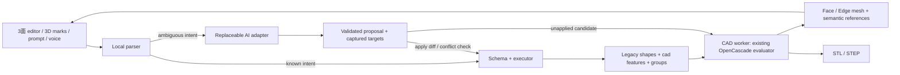

# AI-native CAD foundation

このブランチは既存の3面投影CADを残し、同じ部品JSONへ一般フィーチャーとcommand layerを追加する。Fusionの全機能置換は目的にしない。操作対象を3Dで選び、短い指示で差分を適用することを優先する。

## 調査と再利用

従来の `main.jsx` は約6,050行。3面外形・ロック・polygon-clipping・SVG面プレビュー・距離場STL・replicad STEP・React UI・storage・assemblyが同居していた。3D表示はSVGの面群で、CAD Face/Edgeへのhit-testはなかった。assemblyの選択は部品の投影領域単位だった。

3面形状・ロック制約・STL関連を `cad-core/projection.js` へ、既存のreplicadプリズムと3方向の交差を `kernel.js` へ移した。gear / rack / internal-gearのgeometry modules、model-json migration、projection-consistency、fit-assistをそのまま使う。React入口は約4,100行になった。今回の変更に無関係な図形editorやstorage UIを一括で書き換えない。

追加viewerはThree.jsとOrbitControlsで表示・raycastのみを担当する。CADカーネルは既存のreplicad + OpenCascade/WASMである。

## 境界



| Module | 責務 |
| --- | --- |
| `cad-core/document.js` | versioned extension、feature graph validation、feature tree、ID |
| `cad-core/selectors.js` | entity参照、幾何条件での一意照合、group操作 |
| `cad-core/projection.js` | 既存3面評価、制約、SVG surface、距離場STL |
| `cad-core/kernel.js` | 既存replicadプリズム / intersection |
| `cad-core/evaluator.js` | feature graph再評価、entity対応、B-Rep mesh / export |
| `cad-core/native-features.js` | 旧projectionと独立したSketch solid / fillet / chamfer / direct-face / transform |
| `cad-core/rough-sketch.js` | 正規化stroke、場所付きcomment、mm dimensions、contour schemaとローカル輪郭解釈 |
| `cad-core/topology-display.js` | CAD entityの同一性を保ったままseam / tangent / creaseを分類 |
| `cad-core/runtime.js` / `cad-worker.js` / `client.js` | WASM読込、直列job、非同期RPC |
| `cad-core/mesh.js` | 最終meshから既存SVG / assemblyへの橋渡し |
| `cad-core/assembly.js` | versioned assemblyと部品ID付き拘束参照の境界 |
| `cad-command/schema.js` | allowlist、JSON Schema、runtime validation |
| `cad-command/parser.js` | 小さな日本語 / 数値grammar |
| `cad-command/executor.js` | immutable document差分、依存削除、parameter変更 |
| `cad-command/proposals.js` | snapshot targets、対象bodyの競合検出、最新docへの再適用 |
| `ai-adapter/index.js` / `codex.js` | 交換可能transport、offline / mock、Site依頼作成・応答poll / cancel |
| `site-worker.js` | Sites認証のAPIとstateless HTTP MCP、ユーザー別R2依頼 / 応答 |
| `ui/RoughSketchViewer.jsx` / `SketchPanel.jsx` | 3面ラフ作図、場所付きcomment、寸法、model化 / local preview |
| `ui/NativeViewer.jsx` | 1本指orbit / 2本指pan + dolly、実entityの表示と選択、最終meshの3面図 |
| `ui/useCadWorkspace.js` | 非同期問い合わせ、ghost、apply、cancel、command undo |
| `ui/SelectionToolbar.jsx` | 色・面 / ふち / 部品・選択件数・paintの常時表示 |
| `ui/CommandPanel.jsx` | prompt主導、自然な例文、browser voice、日本語の編集履歴 |

## スマホUIと投影表示

AI画面は独立した `.native-shell`。grid列と子パネルに `minmax(0, …)` / `min-width: 0` を指定し、長いfeature名・削除ボタン・canvasのintrinsic pixel sizeが画面幅を押し広げるのを防ぐ。canvasはCSSで表示サイズを固定し、rendererは `setSize(width, height, false)` を使う。

`visualViewport` のresize / scrollから表示高さ・offsetを更新する。keyboardやブラウザのツールバーが動いても固定されたshell内にviewerと指示欄を収める。指示formは下パネル内のsticky表示。詳細は初期状態で閉じ、日本語の説明・例文を優先する。

OrbitControlsの2本指は `DOLLY_PAN`。回転を混ぜない。複数pointer中は選択を発火しない。fitは全実Bodyのsphereとcamera aspectから距離を決め、dampingの残量を解消してpan / 回転 / zoomを戻す。新Bodyを追加したら全体をfitし、通常の差分編集ではユーザーの視点を保持する。

AI画面の3面図は同一WebGL canvasの4 viewport（正面、上面、右側面、立体）に、**同じ最終B-Rep mesh**を描画する。3面にはorthographic cameraを使い、各viewportのcameraでraycastする。Face / Edge参照、選択色、ghostも共通。元のprojection editorは別メニューで残す。一般featureを古い2D shapesへ変換・上書きすることはしない。

日本語の `赤の角を半径2ミリで丸めて` / `赤の厚さを3ミリにして` / `X方向に5ミリ移動して` / `Z軸まわりに90度回して` などをlocal parserへ追加。量のない曖昧な指示は数字を推測せずadapterへ渡す。UIの例文も同じpipelineを使う。

## 保存形式

旧 `schemaVersion: 5` を保持し、`cad` 拡張v1を維持し、v2へ `draft` / `sketchSolid` を追加した。アプリ内のv1は形状を保ってv2へ移行する。version 0〜5の旧JSONには追加フィールドを強制せず、従来のround tripを維持する。アプリ内では空extensionを補う。旧storage keyは維持する。旧readerへ新しいfeature JSONを戻して編集するとextensionが評価されないため、新形式のファイルはこのブランチで使用する。

```json
{
  "schemaVersion": 5,
  "shapes": [],
  "cad": {
    "schemaVersion": 2,
    "suppressedProjection": false,
    "features": [
      {
        "id": "extrude-1", "type": "extrude",
        "profile": {"type":"rectangle", "width":40, "height":30},
        "distance": 10, "origin": [0,0,0]
      }
    ],
    "selectionGroups": {
      "red": [{
        "featureId":"extrude-1", "entityType":"face",
        "entitySelector": {
          "kind":"geometry", "version":1, "geometryType":"PLANE",
          "center":[0.5,0.5,1], "size":[1,1,0],
          "direction":[0,0,1], "tolerance":0.015
        }
      }],
      "green": [], "blue": []
    }
  }
}
```

既存の3面ソリッドは仮想feature `projection-base` として扱う。元のshapesとshape IDは保持する。一般押出は独立Bodyを作り、fillet / chamfer / transform / faceExtrudeは `input` のBodyを次段へ置き換える。各Bodyは生成元のlineageを持つ。graphは順序付き、循環なし、modifierのinputは未消費のtipだけを許可する。shape ID単位のBoolean provenanceを完全追跡する実装ではない。

## Semantic selectorの最小保証

Faceは面種別・正規化した外接中心と範囲・平面法線、Edgeは曲線種別・正規化した外接中心と範囲・直線方向を保存する。中心と範囲はBody boundsに対する比率なので単純な押出距離変更後も同じ側 / 方向を照合できる。body selectorは生成元と `kind: body` だけである。方向はworld座標、直線の符号はcanonical化する。

selector作成は**mesh生成前の解析的bounds**で行う。OpenCascadeはmesh生成後のbounding boxにdeflectionを含める場合があり、その誤差を永続selectorへ取り込むと再生成後の照合が壊れる。

表示meshのFace/Edge hashはworker内で実B-Repに対応付けるためだけに使用し、永続documentやadapterへ出さない。再生成時は保存したselectorを再解決する。候補0件 / 複数件は失敗とし、近いFaceへ勝手に移さない。これは完全なTopological Naming解ではない。曲面の対称性、分割・融合、大きな形状変更、回転を含む複雑な変更では再選択が必要になる。古いマークは保存に残る場合があるが、照合に失敗したマークを別entityに表示しない。

## Commandと差分

```json
{"operation":"modifyFeature","featureId":"fillet-1","changes":{"radius":3}}
```

```json
{"operation":"extrudeSelectedFaces","selectionGroup":"red","distance":-3}
```

runtime validationは許可operation / field / finite numeric valueを検証し、その後feature graphを検証する。documentをcloneして全commandを適用し、途中失敗は元documentを変更しない。任意JavaScript、GUI操作、自由なproperty path、document全体置換は許可しない。`CAD_COMMAND_SCHEMA` はtransport / WebMCPに渡せるJSON Schemaで、最終的な検証はexecutorとkernelが行う。

| Operation | 初期の動作 |
| --- | --- |
| `addExtrude` | rectangle / circle、XY plane、指定originから符号付き距離 |
| `addSketchSolid` | top XY / front XZ / right YZの正規化polygon / ellipse＋holes。各mm方向プリズムのintersection |
| `modifyFeature` | feature typeが許す数値 / vector / dimensions parameterだけ変更 |
| `changeDistance` | 選択の生成元をたどり押出距離を変更、relative可 |
| `extrudeSelectedFaces` | 平面Faceを法線方向へ押出、負値はcut、穴を保持 |
| `fillet` / `chamfer` | 選択EdgeまたはFaceの境界Edgeに作用 |
| `transform` | 選択Bodyの全体、原点周りXYZ順回転後XYZ移動 |
| `removeSelected` | Bodyの生成元と後続を削除。Face / Edge選択なら拒否 |
| `removeFeature` | 指定featureと依存後続を削除。3面基底なら抑制 |

ローカル処理はLLM待ちがなく、workerの形状検証が完了すると適用する。無効なR値や空形状では適用しない。一般featureを変更しても3面の元shapesを改変しない。3面の既知数値は従来editorを直接使う。

`R3` / `C1` / `3mm` は選択中の対応featureがあればparameterを変え、それ以外では選択groupへ作用する。`反対` / `貫通` / `面一` / `赤を緑まで伸ばして` など、現在のgrammarで一意に扱えない文はadapterへ渡す。単位はmm、回転はdegree。

## AIの非同期性

adapterは `propose(request, { signal }) -> { commands, explanation } | { clarification }`。requestには構造化document、feature tree、entity groups、active group、command contractを渡す。実LLM transportはhostで交換できる。`createChatGPTSiteAdapter` は注入transportのwrapperで、特定SDKをcoreに持ち込まない。静的SiteにAPIキーを置かない。Codex接続は個人用SiteのMCPを介した依頼・提案の受渡し。画面だけでCodexを起動するAPIは使わず、ユーザーがCodexに短く依頼する。APIキーやvendor SDKは不要。静的版はofflineで完結し、明示的mockも残す。

問い合わせはsnapshotを取得してから非同期に進める。選択、camera、prompt、その他のCAD操作をdisableしない。結果を受信してもmodelは変えず、候補documentをworkerで評価しghostへ表示する。ghostは橙色35%透過、確定モデルは通常色。表示・取消はmodelを変更しない。

提案は対象root Bodyの元shape / feature chainを記録する。適用時にその範囲を比較する。対象の形状が変わったら拒否し再指示を求める。camera、色group、無関係のBody変更は保持して最新docへcommandだけ再適用する。worker評価中の更新も再確認し、必要なら再評価する。snapshot selectionを使い、ユーザーが待機中に作ったgroupを上書きしない。cancel / superseded responseは採用しない。

workerはWASM処理を直列化し、UIは非同期RPCだけ使う。各評価の古いレスポンスはsequenceで捨てる。大きいモデルではworkerの待ち行列と再評価コストが残るため、今後はincremental cache / job coalescingを加える余地がある。

## 出力・assembly・拡張点

従来形状のみのSTLは既存の距離場 / Marching Tetrahedraを維持する。一般featureがあるSTLと全STEPは最終B-Repを出力する。STEPはmm単位のcompound。replicad 0.23のXCAF `exportSTEP` にはWorkSessionのraw object / Handle両方のfinalizationが走る問題を実形状テストで観測したため、同じ既存kernelの `shape.blobSTEP()` を使用する。形状と単位は保持するがXCAFの色・部品名metadataは付けない。未延長ラックの輪郭の連続重複点はkernelへ渡す前に除く。

追加featureを含む保存部品はworkerの最終meshを既存assemblyのXYZ / 90度回転 / 色 / 投影へ渡す。旧assemblyも `schemaVersion: 1, constraints: []` を補って読込む。今後の拘束参照は `instanceId` + `entity` を持ち、coaxial / coincident / distance / fixed / freeRotationを独立layerで解く。今回solverや拘束UIは実装していない。

Sketch / Revolve / Cut / Union / Hole / Pattern / Mirrorは今後feature typeの検証・evaluator・command schemaを追加する。失敗しないよう未実装typeを黙って無視しない。既存三面投影基底、一般Body、後段modifierを同じdocumentで扱える境界を今回の出発点にする。

対応ブラウザの `document.modelContext` には `read_cad_document`（read-only）と `stage_cad_commands`（提案の作成のみ）を登録する。後者はGUIと同じschema・kernel・ghostを使用し、確定はUIの適用操作。未対応ブラウザでは登録をスキップする。

## 検証

`npm test` は既存8 test modulesにcommand / selector / async proposal / migration testsと実OpenCascade evaluator testsを追加する。後者はブラウザと同じWASMをNodeで読込み、面の正負押出、R2→R3、chamfer、transform、STEP / STL、bracket / spur gear / rack / internal gearを検証する。

ブラウザsmokeは320〜430px幅・横向き・短いviewportのはみ出し、2本指panとrecenter、面 / ふち / 部品選択、最終形状の3面図、自然な例文、mock待機中の別group選択、ghost適用、R編集、reload / JSON round trip、出力、URL automation、assemblyを確認する。WebMCP APIの登録・valid stage・invalid拒否はbrowser registry shimで確認する。実WebMCP hostでの認証済み呼出確認はこの環境では利用できない。

GitHubへは実験branchだけpushし、mainへmergeしない。GitHub Pages workflowは引き続きmainのみ。個人Sitesは別checkoutから `build:site` と `VITE_AI_NATIVE_START=1 VITE_SITE_CODEX=1` でclient＋小さなWorkerへbuildし、owner-onlyで配信する。通常GitHub Pagesは従来base / 初期documentを維持する。

## ラフスケッチと専用立体処理

`cad.draft` は独立version 1。各面にnormalized [0..1]座標のstroke (`pen` / `rect` / `ellipse`、用途 `outline` / `cut` / `guide`) とanchor付きcommentを保存する。幅・奥行き・高さはmm、notesは全体の意図。drawing更新はgeometryKeyへ含めず、既存立体を再生成・置換しない。起動はスケッチで、Siteの新規documentに自動直方体はない。

ローカル輪郭のプレビューは閉じた外形1個 / viewと穴を処理し、自由線を簡略化してpolygonにする。交差・面積0・寸法0を拒否する。複数外形・曖昧なコメントはCodexへ渡す。寸法は各面の外形全体のmmスケールにする。top XYはheightへ、front XZはdepthへ、right YZはwidthへ伸ばしたB-Repをintersectionする。輪郭がない面は指定寸法までのspanにする。複雑な自由曲面・全スケッチ拘束の復元ではない。

`sketchSolid` はprofilesをnormalized contours、寸法をwidth / depth / height、位置をoriginとして保持する。mm寸法だけを変えて再評価でき、後段のfillet / chamfer / transform / faceExtrudeと既存projection-baseを共存させる。新規形状・丸め・面取りは `native-features.js` を使い、旧SVG / 距離場の角処理は使わない。kernelは既存OpenCascadeを再利用し、新カーネルは実装しない。

Booleanやmodifier後にOpenCascadeのsame-domain cleanupを行う。表示はmeshのCAD normalsを保持し、平面triangleごとに曲面の法線を作り直さない。edgeの隣接faceとkernel continuity、共通edge上のnormalからseam / tangent / creaseを区別する。seamは表示しない、tangentは通常輪郭に出さない。CAD参照自体は削除しない。新規ghostだけでもcamera fitでき、既存部品の隣へ追加するghostも全体を確認できる。

## Codex / 個人Sites MCP

Workerはstateless `POST /mcp` JSON-RPC、initialize / tools/list / tools/callを提供する。発行されたSite専用プラグインのインストール・接続はSitesの既存OAuth境界を使う。独自キー発行・別plugin作成はしない。private Siteのアクセスpolicyも保持する。

1. ブラウザはsnapshotとsketchDraft / task / promptを `POST /api/cad/requests` へ保存する。userはSites ingressの `oai-authenticated-user-id` を使う。R2キーはuser別。APIは未認証を401、存在しない依頼（別user含む）を404にする。POSTの異なるOriginを拒否する。
2. Codexは `list_cad_requests` → `read_cad_request` で最新依頼、entity refs、sketch / comment / mm寸法とcommand contractを読む。
3. `propose_cad_commands` は許可命令1〜20件とexplanation、またはclarificationを保存する。serverではschema / feature graphだけ検証する。R2 conditional writesで回答済み・キャンセル済み・同時更新の上書きを拒否する。
4. ブラウザは1.8秒間隔で非同期poll（最大15分）し、workerで候補形状を生成する。LLM待ちでCAD操作をdisableしない。sketch snapshotの一致と対象bodyの一致を適用直前まで確認する。応答だけではモデルを変えない。

依頼はuser毎最大1MB、comments / strokes / commandsも件数・数値上限を検証する。一覧はR2の小さいmetadataだけを読み、巨大なCAD JSONをまとめてロードしない。24時間内のpending上位20件を返す。古い依頼は非表示になるが自動消去はしない。取消・新規依頼・timeoutはlocal CADを保持する。繰り返し確認したい場合は新しい依頼を送る。Sites authenticated identityをservice tokenで代用しない。

`npm run build` は元の静的GitHub Pagesの出力を維持する。`build:site` だけが `dist/client` と `dist/server/index.js` を生成する。serverにCAD WASMは含まない。`preview-site.mjs` は127.0.0.1だけのQA用で、開発identity・memory R2はproductのbuildに入らない。

検証はrough schema / migration / stale draft、正確な体積によるR・C形状、CAD normalsと接線分類、3面prismと楕円穴 / 円柱、STL / STEP、Site認証・別user分離・conditional write・cancelを含む。`sketch-browser-smoke.py` は空の初期画面、touchで3面に描画、anchor comment、寸法反映、local ghost / apply、数値編集、実local Worker/MCPへのtest提案、待機中のCAD選択、古いスケッチ提案拒否、保存 / resizeを検証する。認証済みの本番Codex呼出はプラグイン接続後にreadonlyで確認する。
