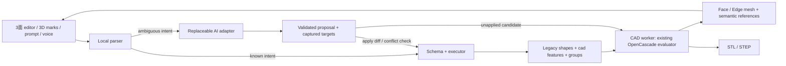

# AI-native CAD foundation

このブランチは既存の3面投影CADを残し、同じ部品JSONへ一般フィーチャーとcommand layerを追加する。Fusionの全機能置換は目的にしない。操作対象を3Dで選び、短い指示で差分を適用することを優先する。

## 調査と再利用

従来の `main.jsx` は約6,050行。3面外形・ロック・polygon-clipping・SVG面プレビュー・距離場STL・replicad STEP・React UI・storage・assemblyが同居していた。3D表示はSVGの面群で、CAD Face/Edgeへのhit-testはなかった。assemblyの選択は部品の投影領域単位だった。

3面形状・ロック制約・STL関連を `cad-core/projection.js` へ、既存のreplicadプリズムと3方向の交差を `kernel.js` へ移した。gear / rack / internal-gearのgeometry modules、model-json migration、projection-consistency、fit-assistをそのまま使う。React入口は約4,100行になった。今回の変更に無関係な図形editorやstorage UIを一括で書き換えない。

追加viewerはThree.jsとOrbitControlsで表示・raycastのみを担当する。CADカーネルは既存のreplicad + OpenCascade/WASMである。

## 境界



| Module | 責務 |
| --- | --- |
| `cad-core/document.js` | versioned extension、feature graph validation、feature tree、ID |
| `cad-core/selectors.js` | entity参照、幾何条件での一意照合、group操作 |
| `cad-core/projection.js` | 既存3面評価、制約、SVG surface、距離場STL |
| `cad-core/kernel.js` | 既存replicadプリズム / intersection |
| `cad-core/evaluator.js` | 一般feature再評価、entity対応、B-Rep mesh / export |
| `cad-core/runtime.js` / `cad-worker.js` / `client.js` | WASM読込、直列job、非同期RPC |
| `cad-core/mesh.js` | 最終meshから既存SVG / assemblyへの橋渡し |
| `cad-core/assembly.js` | versioned assemblyと部品ID付き拘束参照の境界 |
| `cad-command/schema.js` | allowlist、JSON Schema、runtime validation |
| `cad-command/parser.js` | 小さな日本語 / 数値grammar |
| `cad-command/executor.js` | immutable document差分、依存削除、parameter変更 |
| `cad-command/proposals.js` | snapshot targets、対象bodyの競合検出、最新docへの再適用 |
| `ai-adapter/index.js` | offline / mock / transport / Site-host transport interface |
| `ui/NativeViewer.jsx` | 回転・ズーム・tap / paint、実entityの表示と選択 |
| `ui/useCadWorkspace.js` | 非同期問い合わせ、ghost、apply、cancel、command undo |
| `ui/CommandPanel.jsx` | group / prompt / browser voice / feature tree |

## 保存形式

旧 `schemaVersion: 5` を保持し、`cad` 拡張を独立version 1で導入した。version 0〜5の旧JSONには追加フィールドを強制せず、従来のround tripを維持する。アプリ内では空extensionを補う。旧storage keyは維持する。旧readerへ新しいfeature JSONを戻して編集するとextensionが評価されないため、新形式のファイルはこのブランチで使用する。

```json
{
  "schemaVersion": 5,
  "shapes": [],
  "cad": {
    "schemaVersion": 1,
    "suppressedProjection": false,
    "features": [
      {
        "id": "extrude-1", "type": "extrude",
        "profile": {"type":"rectangle", "width":40, "height":30},
        "distance": 10, "origin": [0,0,0]
      }
    ],
    "selectionGroups": {
      "red": [{
        "featureId":"extrude-1", "entityType":"face",
        "entitySelector": {
          "kind":"geometry", "version":1, "geometryType":"PLANE",
          "center":[0.5,0.5,1], "size":[1,1,0],
          "direction":[0,0,1], "tolerance":0.015
        }
      }],
      "green": [], "blue": []
    }
  }
}
```

既存の3面ソリッドは仮想feature `projection-base` として扱う。元のshapesとshape IDは保持する。一般押出は独立Bodyを作り、fillet / chamfer / transform / faceExtrudeは `input` のBodyを次段へ置き換える。各Bodyは生成元のlineageを持つ。graphは順序付き、循環なし、modifierのinputは未消費のtipだけを許可する。shape ID単位のBoolean provenanceを完全追跡する実装ではない。

## Semantic selectorの最小保証

Faceは面種別・正規化した外接中心と範囲・平面法線、Edgeは曲線種別・正規化した外接中心と範囲・直線方向を保存する。中心と範囲はBody boundsに対する比率なので単純な押出距離変更後も同じ側 / 方向を照合できる。body selectorは生成元と `kind: body` だけである。方向はworld座標、直線の符号はcanonical化する。

selector作成は**mesh生成前の解析的bounds**で行う。OpenCascadeはmesh生成後のbounding boxにdeflectionを含める場合があり、その誤差を永続selectorへ取り込むと再生成後の照合が壊れる。

表示meshのFace/Edge hashはworker内で実B-Repに対応付けるためだけに使用し、永続documentやadapterへ出さない。再生成時は保存したselectorを再解決する。候補0件 / 複数件は失敗とし、近いFaceへ勝手に移さない。これは完全なTopological Naming解ではない。曲面の対称性、分割・融合、大きな形状変更、回転を含む複雑な変更では再選択が必要になる。古いマークは保存に残る場合があるが、照合に失敗したマークを別entityに表示しない。

## Commandと差分

```json
{"operation":"modifyFeature","featureId":"fillet-1","changes":{"radius":3}}
```

```json
{"operation":"extrudeSelectedFaces","selectionGroup":"red","distance":-3}
```

runtime validationは許可operation / field / finite numeric valueを検証し、その後feature graphを検証する。documentをcloneして全commandを適用し、途中失敗は元documentを変更しない。任意JavaScript、GUI操作、自由なproperty path、document全体置換は許可しない。`CAD_COMMAND_SCHEMA` はtransport / WebMCPに渡せるJSON Schemaで、最終的な検証はexecutorとkernelが行う。

| Operation | 初期の動作 |
| --- | --- |
| `addExtrude` | rectangle / circle、XY plane、指定originから符号付き距離 |
| `modifyFeature` | feature typeが許す数値 / vector parameterだけ変更 |
| `changeDistance` | 選択の生成元をたどり押出距離を変更、relative可 |
| `extrudeSelectedFaces` | 平面Faceを法線方向へ押出、負値はcut、穴を保持 |
| `fillet` / `chamfer` | 選択EdgeまたはFaceの境界Edgeに作用 |
| `transform` | 選択Bodyの全体、原点周りXYZ順回転後XYZ移動 |
| `removeSelected` | Bodyの生成元と後続を削除。Face / Edge選択なら拒否 |
| `removeFeature` | 指定featureと依存後続を削除。3面基底なら抑制 |

ローカル処理はLLM待ちがなく、workerの形状検証が完了すると適用する。無効なR値や空形状では適用しない。一般featureを変更しても3面の元shapesを改変しない。3面の既知数値は従来editorを直接使う。

`R3` / `C1` / `3mm` は選択中の対応featureがあればparameterを変え、それ以外では選択groupへ作用する。`反対` / `貫通` / `面一` / `赤を緑まで伸ばして` など、現在のgrammarで一意に扱えない文はadapterへ渡す。単位はmm、回転はdegree。

## AIの非同期性

adapterは `propose(request, { signal }) -> { commands, explanation } | { clarification }`。requestには構造化document、feature tree、entity groups、active group、command contractを渡す。実LLM transportはhostで交換できる。`createChatGPTSiteAdapter` は注入transportのwrapperで、特定SDKをcoreに持ち込まない。静的SiteにAPIキーを置かない。現時点で組込みの実LLM接続はなく、offlineと明示的mockで一連の処理を試せる。

問い合わせはsnapshotを取得してから非同期に進める。選択、camera、prompt、その他のCAD操作をdisableしない。結果を受信してもmodelは変えず、候補documentをworkerで評価しghostへ表示する。ghostは橙色35%透過、確定モデルは通常色。表示・取消はmodelを変更しない。

提案は対象root Bodyの元shape / feature chainを記録する。適用時にその範囲を比較する。対象の形状が変わったら拒否し再指示を求める。camera、色group、無関係のBody変更は保持して最新docへcommandだけ再適用する。worker評価中の更新も再確認し、必要なら再評価する。snapshot selectionを使い、ユーザーが待機中に作ったgroupを上書きしない。cancel / superseded responseは採用しない。

workerはWASM処理を直列化し、UIは非同期RPCだけ使う。各評価の古いレスポンスはsequenceで捨てる。大きいモデルではworkerの待ち行列と再評価コストが残るため、今後はincremental cache / job coalescingを加える余地がある。

## 出力・assembly・拡張点

従来形状のみのSTLは既存の距離場 / Marching Tetrahedraを維持する。一般featureがあるSTLと全STEPは最終B-Repを出力する。STEPはmm単位のcompound。replicad 0.23のXCAF `exportSTEP` にはWorkSessionのraw object / Handle両方のfinalizationが走る問題を実形状テストで観測したため、同じ既存kernelの `shape.blobSTEP()` を使用する。形状と単位は保持するがXCAFの色・部品名metadataは付けない。未延長ラックの輪郭の連続重複点はkernelへ渡す前に除く。

追加featureを含む保存部品はworkerの最終meshを既存assemblyのXYZ / 90度回転 / 色 / 投影へ渡す。旧assemblyも `schemaVersion: 1, constraints: []` を補って読込む。今後の拘束参照は `instanceId` + `entity` を持ち、coaxial / coincident / distance / fixed / freeRotationを独立layerで解く。今回solverや拘束UIは実装していない。

Sketch / Revolve / Cut / Union / Hole / Pattern / Mirrorは今後feature typeの検証・evaluator・command schemaを追加する。失敗しないよう未実装typeを黙って無視しない。既存三面投影基底、一般Body、後段modifierを同じdocumentで扱える境界を今回の出発点にする。

対応ブラウザの `document.modelContext` には `read_cad_document`（read-only）と `stage_cad_commands`（提案の作成のみ）を登録する。後者はGUIと同じschema・kernel・ghostを使用し、確定はUIの適用操作。未対応ブラウザでは登録をスキップする。

## 検証

`npm test` は既存8 test modulesにcommand / selector / async proposal / migration testsと実OpenCascade evaluator testsを追加する。後者はブラウザと同じWASMをNodeで読込み、面の正負押出、R2→R3、chamfer、transform、STEP / STL、bracket / spur gear / rack / internal gearを検証する。

ブラウザsmokeはスマホ幅で3D選択、mock待機中の別group選択、ghost適用、R編集、reload / JSON round trip、出力、URL automation、assemblyを確認する。WebMCP APIの登録・valid stage・invalid拒否はbrowser registry shimで確認する。実WebMCP hostでの認証済み呼出確認はこの環境では利用できない。

GitHubへは実験branchだけpushし、mainへmergeしない。GitHub Pages workflowは引き続きmainのみ。個人Sitesは別checkoutから `--base /` と `VITE_AI_NATIVE_START=1` で静的buildし、owner-onlyで配信する。通常GitHub Pagesは従来base / 初期documentを維持する。
